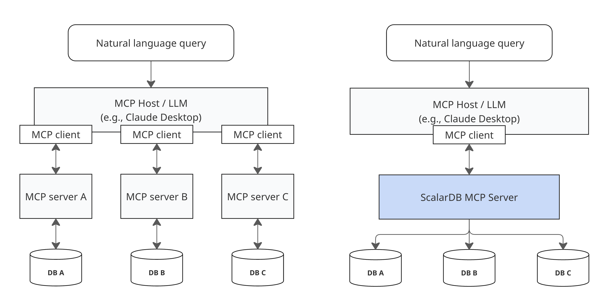

# ScalarDB MCP Server

ScalarDB MCP Server is a [Model Context Protocol (MCP)](https://modelcontextprotocol.io/) implementation that enables LLMs to access and manage your data through ScalarDB. By leveraging LLMs, you can use natural language to search and update across multiple, potentially siloed, databases.

## What is ScalarDB MCP Server?

ScalarDB MCP Server works seamlessly whether you're using a single database or multiple databases. Unlike traditional approaches that require separate MCP servers for each database, ScalarDB MCP Server leverages the [multi-storage capabilities of ScalarDB](https://scalardb.scalar-labs.com/docs/latest/multi-storage-transactions) to provide unified access to heterogeneous databases (PostgreSQL, MySQL, Cosmos DB, DynamoDB, etc.) through a single MCP server. By simply submitting queries in natural language, the server automatically executes the appropriate operations across your databases, improving and accelerating decision-making processes.

### Key features

- **Works with single or multiple databases:** Whether you have one database or many databases managed by ScalarDB, ScalarDB MCP Server provides a unified natural language interface.
- **AI-powered automation:** Use conversational queries—the LLM automatically generates and executes the appropriate database operations.
- **ACID-compliant transactions:** Maintain data integrity with full transactional support across databases.
- **Dual operational modes:** SQL mode for ScalarDB Cluster (leveraging the SQL interface) or CRUD mode for ScalarDB Community edition (by using ScalarDB Core).

## Docs

* **[Getting Started with ScalarDB MCP Server](https://scalardb.scalar-labs.com/docs/latest/scalardb-mcp-server/getting-started):** Installation and quickstart guide
* **[ScalarDB MCP Server Tools Reference](https://scalardb.scalar-labs.com/docs/latest/scalardb-mcp-server/tools-reference):** Complete documentation of all available MCP tools

## Quickstart

Get started with ScalarDB MCP Server in three steps:

1. **Install:** Download the Docker image or JAR file.
2. **Configure:** Connect to your ScalarDB deployment and MCP client.
3. **Use:** Start querying your databases by using natural language.

For complete installation and setup instructions, see [Getting Started with ScalarDB MCP Server](https://scalardb.scalar-labs.com/docs/latest/scalardb-mcp-server/getting-started).

**Example queries once configured:**

- `Show me all users from the customer table`
- `Create a new table called products with columns id, name, and price`
- `Get user profile and order history for user ID 123`

## ScalarDB version compatibility

| ScalarDB MCP Server | ScalarDB Community | ScalarDB Cluster | Java Version |
|---------------------|--------------------|------------------|--------------|
| 0.9.x               | 3.16+              | 3.16+            | 17+          |

**Note about operational mode:**
- **ScalarDB Cluster:** Use SQL mode for efficient operations (recommended) or CRUD mode for granular control.
- **ScalarDB Community edition:** Use CRUD mode only (SQL interface not available).

### Reporting issues

If you find a bug or have a feature request, please [open an issue](https://github.com/scalar-labs/scalardb-mcp-server/issues).

## Community

- **[GitHub Issues](https://github.com/scalar-labs/scalardb-mcp-server/issues):** Report bugs and request features.
- **[ScalarDB Documentation](https://scalardb.scalar-labs.com/):** Learn more about ScalarDB.
